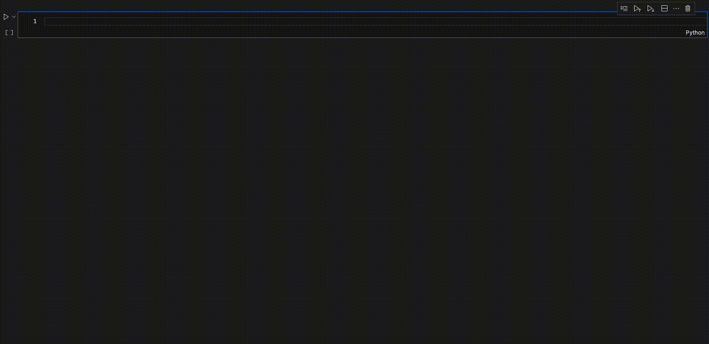

<h1 style="text-align: center;">
  
  ESO Science Archive - Jupyter Notebooks
</h1>

# **Introduction**

This repository contains a suite of Jupyter notebooks designed to demonstrate how to explore, query, and retrieve data from the [ESO Science Archive](https://archive.eso.org/cms.html) using Python. The primary interface used is the `astroquery.eso` module, which is part of the broader [astroquery](https://astroquery.readthedocs.io/en/latest/) package developed under the Astropy ecosystem.

These notebooks walk through both introductory and advanced examples that are relevant for a wide range of scientific use cases — from downloading raw and reduced data products, to analyzing spectra and imaging datasets retrieved from ESO facilities at La Silla and Paranal (including the Very Large Telescope - VLT - and the Very Large Telescope Interferometer - VLTI), as well as from submillimeter and radio observatories -- APEX and ALMA.

Whether you're new to archival astronomy or already familiar with ESO's observing systems, these examples provide practical guidance for integrating archive queries into reproducible, scriptable workflows.

## 📚 Included Notebooks

- `ESO_Introduction.ipynb` — Introduction to `astroquery.eso` and its basic functionality (e.g. listing instruments, setting credentials)
- `ESO_Query_*.ipynb` — Focused demonstrations of specific search and filtering operations using TAP queries, cone searches, and dataset metadata
- `ESO_WorkingExample_*.ipynb` — Real-world examples combining archive access with data inspection, plotting, and scientific analysis (e.g. radial velocities, spectral line studies)

## Quick Start: Using `astroquery.eso`

To get started, you can load and initialize the ESO archive interface directly in your notebook:

```python
from astroquery.eso import Eso  # Import the ESO module from astroquery
eso = Eso()                     # Create an instance of the ESO class
eso                             # Display the class instance (e.g. check login status, default settings)
```

[](https://mybinder.org/v2/git/https%3A%2F%2Fgithub.com%2Feso%2Fastroquery_examples/main?urlpath=%2Fdoc%2Ftree%2FESO_Introduction.ipynb)

**You can try it directly [in mybinder](https://mybinder.org/v2/git/https%3A%2F%2Fgithub.com%2Feso%2Fastroquery_examples/main), without installing anything.**

Once initialized, you can search by program ID, target name, position, or instrument, and download data products directly into your working directory — all from within the notebook environment.




# **About the ESO Science Archive**

The ESO Science Archive Facility (SAF) is one of the largest ground-based astronomical data repositories in the world. It contains data from ESO telescopes at La Silla, Paranal, and APEX, as well as the submillimeter APEX telescope on Llano de Chajnantor and the ALMA array. The archive includes all raw data from La Silla Paranal Observatory, the corresponding calibrations, and a wide range of processed data products, either generated by ESO or contributed by the community. It also hosts selected external datasets, such as raw WFCAM/UKIDSS data from the UKIRT facility in Hawaii.

As of **May 2025**, the archive hosts over **4.6 million** science products, including:

- [3.8 million products from La Silla, Paranal, and APEX ](https://archive.eso.org/scienceportal/home?observatory=%22La%20Silla%20Paranal%20APEX%22) 
- [700 000 ALMA products](https://archive.eso.org/scienceportal/home?observatory=ALMA)  
- [2.3 million spectra](https://archive.eso.org/scienceportal/home?dp_type=SPECTRUM) (1D extracted, fully calibrated)  
- [900 000 imaging products](https://archive.eso.org/scienceportal/home?dp_type=IMAGE) in optical, near-IR, and sub-mm bands  
- [500 000 spectral cubes](https://archive.eso.org/scienceportal/home?dp_type=CUBE) from IFU and radio/mm instruments  
- [700 000 catalogue records](https://archive.eso.org/scienceportal/home?dp_type=CATALOG)

Processed data downloaded from the ESO Archive are assigned a Digital Object Identifier (DOI). You can browse the list of available DOIs [here](https://archive.eso.org/wdb/wdb/doi/collections/query).

Access to data follows ESO’s standard data policy: the Principal Investigator (PI) of an observing program has exclusive access to their data during a proprietary period (typically one year), after which the data become publicly available. See the [ESO Data Access Policy](https://archive.eso.org/cms/eso-data-access-policy.html) and [FAQ](https://archive.eso.org/cms/faq.html?q=proprietary) for more information. Browsing the archive does not require authentication, but login is necessary to access proprietary datasets. Use of ESO archival data should be acknowledged in all publications.

## **Data Access**

There are four main ways to access the vast information in the ESO Archive:

- [Raw Data query form](http://archive.eso.org/eso/eso_archive_main.html) - Full access to raw frames and their calibrations.
- [Science Portal](http://archive.eso.org/scienceportal/home) - Browse and retrieve processed (Phase 3) data.
- [Catalogue Query Interface](https://www.eso.org/qi/) - Access PI-contributed catalogue data.
- [Programmatic access page](http://archive.eso.org/programmatic/) - Direct, scriptable access to raw and processed data, metadata, ambient conditions, and catalogues via Virtual Observatory (VO) protocols.

These notebooks focus on the last method: accessing the archive programmatically using the `astroquery.eso` module. Note that at present (May 2025), catalogue searches are not supported using the `astroquery.eso` module. Functionality for querying catalogues will be added in a future release.

## **Contributing your own data to the ESO archive**

The scientific community plays a vital role in expanding and enriching the ESO Science Archive. ESO provides the [ESO Phase 3 process](https://www.eso.org/sci/observing/phase3.html), a structured way to submit processed data products, ensuring long-term accessibility and usability across a broad range of astronomical fields. By sharing your own data, you contribute to the collective scientific effort, allowing others to query your datasets (as you are here), and build upon your work. To learn more about the submission process, visit the [ESO Phase 3 guidelines](https://www.eso.org/sci/observing/phase3.html).

<!-- # **astroquery.eso**

Astroquery is part of the Astropy project and offers a unified, consistent interface to query a wide range of astronomical databases. In addition to the ESO module, astroquery supports archives such as NASA’s Exoplanet Archive, SIMBAD, SDSS, GAIA, and many others. This seamless integration with Astropy’s tools and data structures simplifies the process of combining data from multiple sources in your research. For comprehensive details, including usage examples, API documentation, troubleshooting tips, and updates, please refer to the official astroquery documentation at [astroquery.readthedocs.io](https://astroquery.readthedocs.io/en/latest/index.html). 

The ESO [astroquery](https://astroquery.readthedocs.io/en/latest/eso/eso.html) module, `astroquery.eso`, provides simple wrappers to efficiently embed access to the [ESO archive](http://archive.eso.org/cms.html) into Python routines. Currently, the module supports:

- Listing available instruments
- Listing available surveys (phase 3)
- Searching all instrument-specific raw data ([more info](http://archive.eso.org/cms/eso-data/instrument-specific-query-forms.html))
- Searching data products (phase 3) ([more info](http://archive.eso.org/wdb/wdb/adp/phase3_main/form))
- Downloading data by dataset identifiers ([more info](http://archive.eso.org/cms/eso-data/eso-data-direct-retrieval.html)) -->

# **Additional Information**

## **Prerequisites and Installation**  
These examples assume that you have a working Python environment (Python `3.9` or later is recommended) and that you have installed the necessary packages. You can install astroquery (which includes the ESO module) via pip:

```shell
> pip install astroquery
```

Or as part of the `astropy` module (note however this can be an older release): 


```shell
> pip install astropy
```

Additional useful packages used in these notebooks are as follows: 
- Jupyter Notebook or Jupyter Lab 
- Recommended common libraries: `numpy`, `matplotlib`, `astropy`, `tqdm`, `pandas`
- Recommended less common libraries (used in the more advanced analysis scripts): `astral`, `datetime`, `coronagraph`, `PyAstronomy`

You can install these dependencies using, for example:
```shell
> pip install numpy matplotlib astropy astroquery
```

Uniquely in the Astropy ecosystem, Astroquery is operating with a continuous deployment model. It means that a release is instantaneously available after a pull request has been merged. These releases are automatically uploaded to ``PyPI``, and therefore the latest version of astroquery can be ``pip`` installed. The version number of these automated releases contain the "dev" tag, thus pip needs to be told to look for these releases during an upgrade, using the ``--pre`` install option. If astroquery is already installed, please make sure you use the ``--upgrade`` (or ``-U``) install option as well.

## **Usage**  
You can access this file as an interactive jupyter notebook, which you can download and run on your machine [(instructions)](https://jupyter.org/install). To interact with the jupyter notebook (if you have download it): move up and down the various cells using the arrow keys, execute the code by pressing CTRL+ENTER; you can also modify the code and execute it at will.

## **Version** 
Please note that this notebook uses Python version 3.9.21 and Jupyter Notebook version 6.4.10. Compatibility with other versions cannot be guaranteed.

# Contributing
Contributions are welcome! If you'd like to contribute, please fork the repository and submit a pull request with your improvements.

# License
This project is licensed under the ``MIT License`` - see the ``LICENSE`` file for details.
